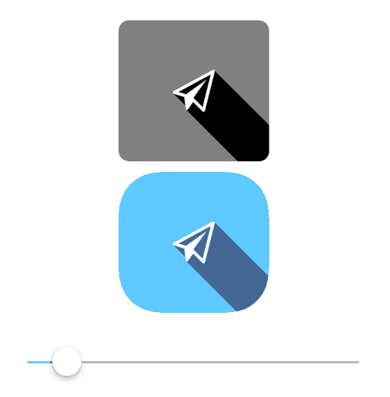

LSButton
==============================
Long shadow button for iOS

Installation
------------
Just copy LSButton.h,LSButton.m into your project.

Usage
-----
With storyboard.
Just change then UIButton class to LSButton.
And set the image.

